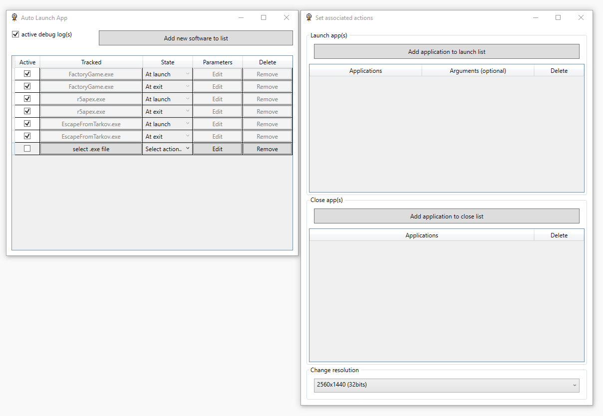

# Auto-Launch-App
Auto Launch App track another app and execute many operation after detect state changed

### Screenshots

### Updates 
#### update 1.1 beta
- Add option to enable/disable logs;
- Fix crash at first startup;
- Fix the bug that changed resolution automatically after reboot;
- Fix the bug that changed resolution many time after close program;
- The json file is rename to "list.json" (wipe all your rules);
- Details window have now min height and width;
- Main window have minor change;
- Others minors fix;

### Credits

Mohammad Elsheimy for DisplayConvert [sources](https://www.codeproject.com/Articles/36664/Changing-Display-Settings-Programmatically)
